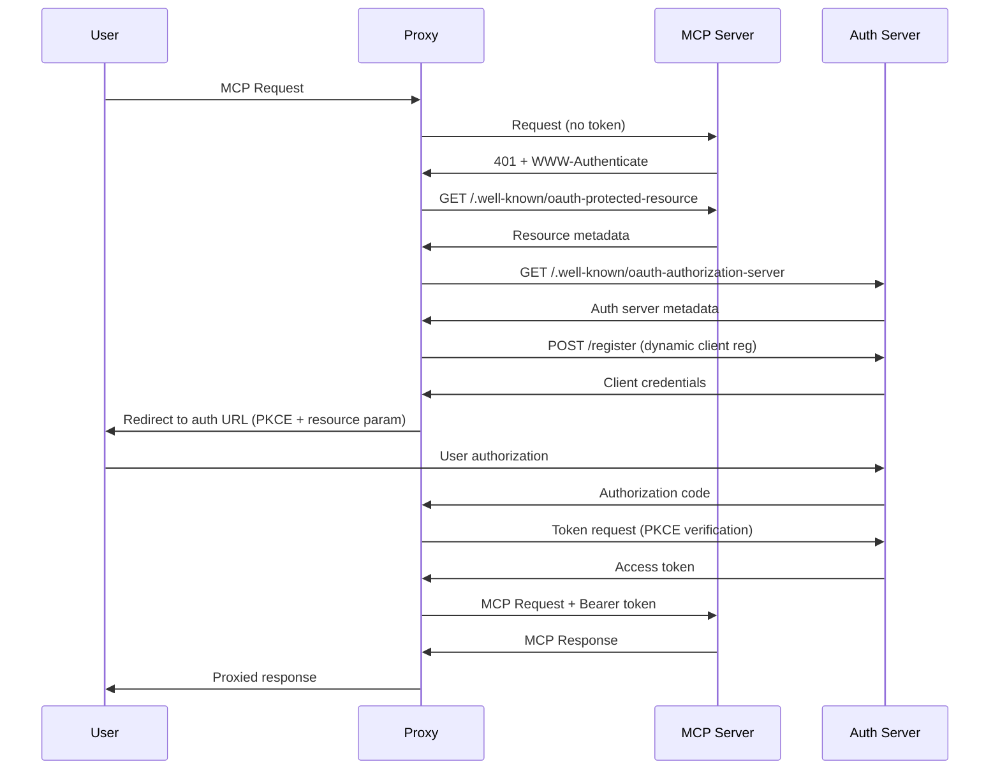

# SUSE AI Universal Proxy - Security

## MCP Authorization Flow Security

### Overview
The SUSE AI Universal Proxy implements the [MCP Authorization Specification](https://modelcontextprotocol.io/specification/2025-06-18/basic/authorization) to provide secure access to OAuth 2.1 protected MCP servers.

### Security Architecture

#### OAuth 2.1 Implementation
- **Resource Server Role**: Proxy acts as OAuth client to MCP servers
- **Client Registration**: Supports dynamic client registration (RFC7591)
- **PKCE Protection**: Mandatory Proof Key for Code Exchange
- **Resource Indicators**: RFC 8707 compliance with `resource` parameter

#### Token Security
- **Audience Validation**: Tokens validated for correct MCP server audience
- **No Token Passthrough**: Client tokens never forwarded to other services
- **Secure Storage**: Encrypted token storage with automatic rotation
- **Token Refresh**: Automatic token renewal before expiration

### Authorization Flow Example



### Configuration Security

#### Secure Configuration Options
```yaml
authorization:
  enabled: true
  clientRegistration:
    dynamic: true  # Use dynamic registration when possible
    staticClients: # Fallback for servers without dynamic reg
      - server: "https://mcp.example.com"
        clientId: "${CLIENT_ID}"  # Use environment variables
        clientSecret: "${CLIENT_SECRET}"
  tokenStorage:
    encryptionKey: "${ENCRYPTION_KEY}"  # Required for production
    rotationInterval: "24h"
  flows:
    redirectUri: "https://proxy.example.com/oauth/callback"
    timeout: "5m"
    pkceRequired: true  # Always enabled
```

#### Environment Variables
```bash
# Required for production
export ENCRYPTION_KEY="32-char-encryption-key-here"
export CLIENT_ID="proxy-client-id"
export CLIENT_SECRET="proxy-client-secret"

# Optional OAuth server credentials
export OAUTH_CLIENT_ID="global-client-id"
export OAUTH_CLIENT_SECRET="global-client-secret"
```

### Threat Mitigation

#### 1. Token Theft Protection
- **Short-lived Tokens**: Automatic token refresh before expiration
- **Encrypted Storage**: Tokens encrypted at rest
- **Memory-only Sessions**: No persistent token storage in files
- **Token Rotation**: Refresh tokens rotated on each use

#### 2. Authorization Code Injection
- **PKCE Mandatory**: All flows use Proof Key for Code Exchange
- **State Validation**: CSRF protection with state parameters
- **Redirect URI Validation**: Strict redirect URI checking

#### 3. Confused Deputy Prevention
- **Audience Validation**: Tokens validated for correct audience
- **Resource Parameters**: RFC 8707 resource indicators prevent token misuse
- **No Token Forwarding**: Client tokens never passed to other services

#### 4. Communication Security
- **HTTPS Only**: All OAuth endpoints require HTTPS
- **TLS Validation**: Strict certificate validation
- **HSTS Headers**: HTTP Strict Transport Security

### Operational Security

#### Monitoring & Alerting
```bash
# Check authorization status
curl http://localhost:8001/adapters/{name}/auth/status

# Monitor token expiration
curl http://localhost:8001/adapters/{name}/sessions | jq '.sessions[].tokenExpiresAt'

# View authorization events
tail -f /var/log/proxy/authorization.log
```

#### Incident Response
1. **Token Compromise**: Immediately revoke via `DELETE /adapters/{name}/auth/tokens`
2. **Authorization Failures**: Check logs for OAuth error details
3. **Suspicious Activity**: Monitor for unusual authorization patterns

#### Audit Logging
All authorization events are logged:
```
2024-01-01T12:00:00Z INFO Authorization started for adapter=mcp-server user=alice
2024-01-01T12:00:05Z INFO Token obtained for adapter=mcp-server expires=2024-01-01T13:00:00Z
2024-01-01T12:30:00Z INFO Token refreshed for adapter=mcp-server
```

### Best Practices

#### Production Deployment
1. **Enable HTTPS**: Configure TLS termination
2. **Set Encryption Key**: Required for token storage
3. **Configure Redirect URIs**: Register proxy callback URLs with auth servers
4. **Monitor Token Usage**: Set up alerts for unusual patterns
5. **Regular Key Rotation**: Rotate encryption keys periodically

#### Development Setup
1. **Use Local Auth Server**: For testing, use local OAuth server
2. **Disable Auto-Auth**: Test manual authorization flows
3. **Enable Debug Logging**: Log authorization flow details
4. **Validate Tokens**: Test token validation logic

### Compliance

#### OAuth 2.1 Standards
- ✅ RFC 6749 - OAuth 2.0 Authorization Framework
- ✅ RFC 6750 - OAuth 2.0 Bearer Token Usage
- ✅ RFC 7591 - OAuth 2.0 Dynamic Client Registration
- ✅ RFC 8414 - OAuth 2.0 Authorization Server Metadata
- ✅ RFC 8707 - Resource Indicators for OAuth 2.0
- ✅ RFC 9728 - OAuth 2.0 Protected Resource Metadata

#### Security Standards
- ✅ PKCE (RFC 7636) implementation
- ✅ JWT token validation
- ✅ Secure token storage
- ✅ HTTPS communication requirements

### Troubleshooting

#### Common Issues

**401 Unauthorized from MCP Server**
```bash
# Check if authorization is configured
curl http://localhost:8001/adapters/{name}/auth/status

# Trigger manual authorization
curl -X POST http://localhost:8001/adapters/{name}/auth/authorize
```

**Token Expired**
```bash
# Force token refresh
curl -X POST http://localhost:8001/adapters/{name}/auth/refresh
```

**OAuth Discovery Failed**
```bash
# Check MCP server metadata endpoint
curl https://mcp.example.com/.well-known/oauth-protected-resource

# Verify authorization server
curl https://auth.example.com/.well-known/oauth-authorization-server
```

### Implementation Status

#### Completed Features
- ✅ OAuth client registration infrastructure
- ✅ Token storage and management
- ✅ Authorization flow orchestration
- ✅ 401 response handling with WWW-Authenticate parsing
- ✅ Bearer token injection in proxied requests
- ✅ Session-based authorization state tracking

#### Future Enhancements
- 🔄 Full OAuth discovery implementation
- 🔄 PKCE challenge-response flow
- 🔄 Automatic token refresh
- 🔄 Resource indicator validation
- 🔄 Dynamic client registration
- 🔄 Browser-based authorization UI